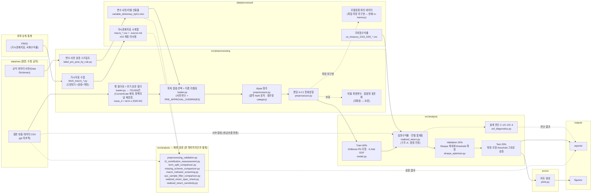
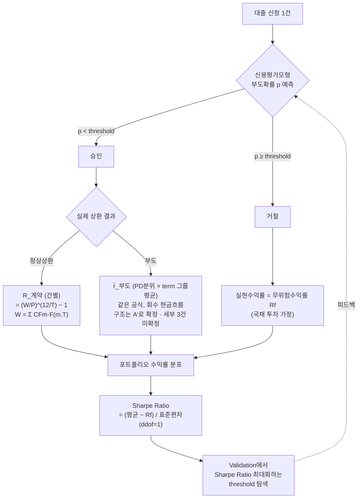

# 아키텍처 개요

## 1. 데이터 파이프라인



> `VAL` 그룹은 **본 파이프라인이 아니다** — 문서에 실린 표를 다시 만드는 재현·검증 스크립트이며,
> 원본/산출물을 읽어 `outputs/`에 근거를 남기는 곁가지다. `config.yaml`의 6:2:2를 따르지 않고
> 자체 분할을 쓴다 (`AGENTS.md`의 코드 색인 ② 참고).
>
> 실선 노드 = 이미 구현/확정된 단계, 점선 노드 = 아직 구현되지 않았거나 팀 미확정인 단계.
> `P1`~`P4`는 **구현 완료**다(커밋 `7e1cb9d`) — 함수 목록은 `src/preprocessing/AGENTS.md`의
> 「구현 — 어느 함수를 부르는가」. `P5`(파생변수·컬럼명)는 미확정이라 보류 상태다.
>
> ⚠️ **거시지표는 본 파이프라인에 결합하지 않는다** — #15에서 **최종 미사용으로 확정**됐다.
> **수집**(`B3`)은 완료돼 `C3`에 남아 있으나, 이제 재현·검증(`V1`)과 과거 기록 용도뿐이다.
> lag·level/YoY·다중공선성 검토는 **종결된 논의**다(`macro_indicator_selection.md`는 배경 자료).
>
> ⚠️ 결측은 **NaN 그대로 투입**하고 범주형은 **`category` dtype**으로 넘긴다 — 결측 더미도,
> 원-핫 더미도 만들지 않는다(#13 ③·#17 ①). 표준화·로그변환·구간화·캡핑도 하지 않는다.
>
> 무위험수익률(`C4`)은 독립변수가 아니라 실현수익률·Sharpe 계산(`D2`)에만 쓴다 —
> 발행시점 × 만기매칭이라 고정 상수가 아니다(#18).
> `A1 -.-> D2` 점선은 **사후(post-approval) 컬럼**(`total_pymnt`·`recoveries` 등)이 실현수익률
> 계산에만 들어간다는 뜻이다 — **피처 테이블에는 절대 넣지 않는다**(누수, `src/preprocessing/AGENTS.md`).

## 2. 승인/거절 의사결정 로직 (Sharpe Ratio 최적화)



> Test set은 위 피드백 루프(threshold 재탐색)에 참여하지 않는다 — 확정된 모형·threshold를 그대로 적용해 검증만 한다.
>
> **재투자 가정(확정, `decision_log.md` #18)**: `RET1`·`RET2` 모두 **매달 받는 상환액을 잔존기간에
> 맞춘 국채에 재투자**한다고 보고 만기 `T` 시점 종가로 평가한다. `F(m,T)`는 `m`월 수령액을 `T`까지
> 굴린 성장배수다. 정상상환·부도 양쪽에 같은 관례를 쓰므로 **"정상상환 = `int_rate`"는 폐기**됐다.
>
> **실현수익률 구조 — A′ 확정** (`decision_log.md` #20, 2026-07-30):
> `RET2`(부도)는 **PD 분위(× term)별 그룹 평균**, `RET1`(정상상환)은 **건별 계약 현금흐름**으로 계산한다.
> ```
> E[XR] = (1 − p̂)·XR_계약  +  p̂·r̄_부도,d
> ```
> **구조 B(2단계 hurdle 건별 회귀)는 기각됐다 — 위 그림에 부도 서브셋 회귀 모델은 없다.** 모형은
> `M`(PD 분류기) 하나뿐이다.
>
> ⚠️ **계산 세부 3건은 미확정**이며 B팀 담당이다(#20) — **조기상환 보정 방식**(1순위: 계약 현금흐름만
> 쓰면 `RET1`이 과대추정된다), 국채 금리 기준(ⓒ발행시점 고정 권고), 서비스수수료. 잠정값으로 진행
> 가능하나, 확정 시 `SR`과 `TH`의 값이 함께 달라진다.
>
> ⚠️ `TH`의 **랭킹 기준은 미확정**이다 — `p̂` 단독 / `E[XR]` / `q_score`(= `E[XR]/√Var[XR]`).
> Validation에서만 비교해 사전 확정한 뒤 Test 1회(#5·#20).
>
> ⚠️ `SR`은 **절대값을 성과로 보고하지 않는다.** 재투자 가정이 모형 전략과 approve-all 대조군(#17 ②)을
> 똑같이 밀어올리므로, 헤드라인 지표는 **Δ Sharpe = (모형 − approve-all)** 이다.

## 참고

이 다이어그램은 단순화된 개요이며, 아래 세부 방법론은 의도적으로 생략했다 — 최신 내용은 각 문서를 참고:
- Threshold 확정 후 Train 전체 재학습, 안정성 검증(30-seed 반복), "전부 승인" 베이스라인 비교: `src/analysis/AGENTS.md`
- 개별 대출 IRR 심화 계산, 대출 간 독립성 문제, 수익률 분포 히스토그램, 사전적·사후적 Sharpe Ratio 구분: `README.md`
