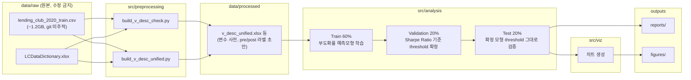
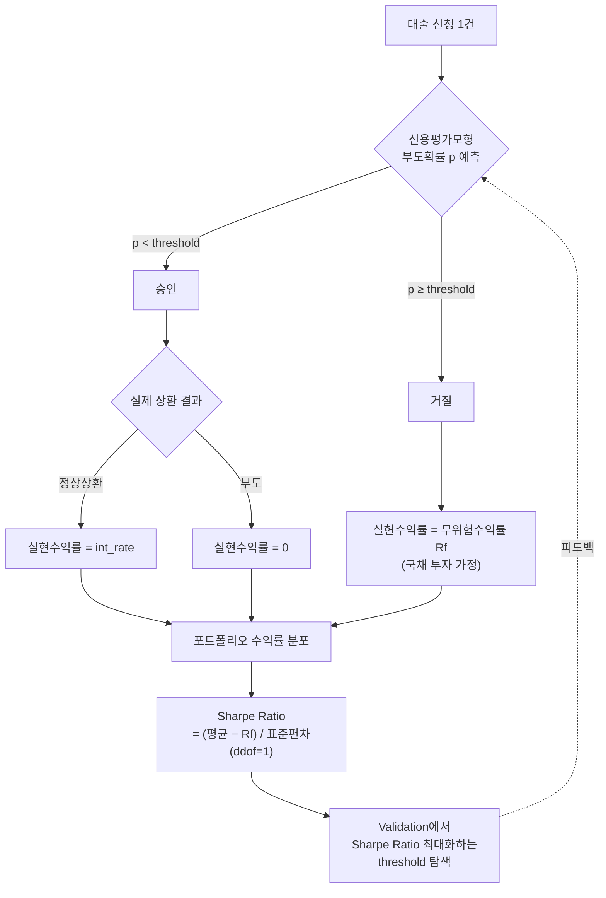

# 아키텍처 개요

## 1. 데이터 파이프라인

```mermaid
graph LR
    subgraph RAW["data/raw (원본, 수정 금지)"]
        A1["lending_club_2020_train.csv<br/>(~1.2GB, git 미추적)"]
        A2["LCDataDictionary.xlsx"]
    end

    subgraph PRE["src/preprocessing"]
        B1["build_v_desc_check.py"]
        B2["build_v_desc_unified.py"]
    end

    subgraph PROC["data/processed"]
        C1["v_desc_unified.xlsx 등<br/>(변수 사전, pre/post 라벨 초안)"]
    end

    subgraph AN["src/analysis"]
        D1["Train 60%<br/>부도확률 예측모형 학습"]
        D2["Validation 20%<br/>Sharpe Ratio 기준 threshold 확정"]
        D3["Test 20%<br/>확정 모형·threshold 그대로 검증"]
    end

    subgraph VIZ["src/viz"]
        E1["차트 생성"]
    end

    subgraph OUT["outputs"]
        F1["reports/"]
        F2["figures/"]
    end

    A1 --> B1
    A1 --> B2
    A2 --> B1
    A2 --> B2
    B1 --> C1
    B2 --> C1
    C1 --> D1 --> D2 --> D3
    D3 --> E1 --> F2
    D3 --> F1
```

## 2. 승인/거절 의사결정 로직 (Sharpe Ratio 최적화)

```mermaid
graph TD
    L["대출 신청 1건"] --> M{"신용평가모형<br/>부도확률 p 예측"}
    M -->|"p < threshold"| APP["승인"]
    M -->|"p ≥ threshold"| REJ["거절"]

    APP --> R1{"실제 상환 결과"}
    R1 -->|"정상상환"| RET1["실현수익률 = int_rate"]
    R1 -->|"부도"| RET2["실현수익률 = 0"]

    REJ --> RET3["실현수익률 = 무위험수익률 Rf<br/>(국채 투자 가정)"]

    RET1 --> PORT["포트폴리오 수익률 분포"]
    RET2 --> PORT
    RET3 --> PORT

    PORT --> SR["Sharpe Ratio<br/>= (평균 − Rf) / 표준편차(ddof=1)"]
    SR --> TH["Validation에서<br/>Sharpe Ratio 최대화하는<br/>threshold 탐색"]
    TH -.피드백.-> M
```

> Test set은 위 피드백 루프(threshold 재탐색)에 참여하지 않는다 — 확정된 모형·threshold를 그대로 적용해 검증만 한다.
