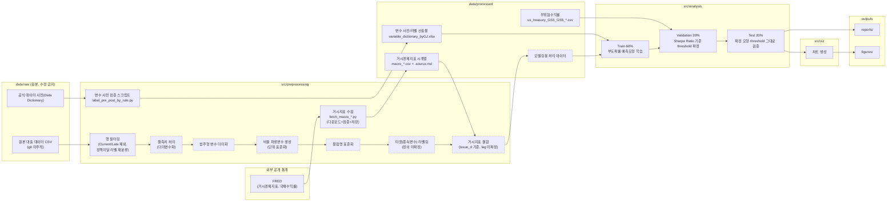
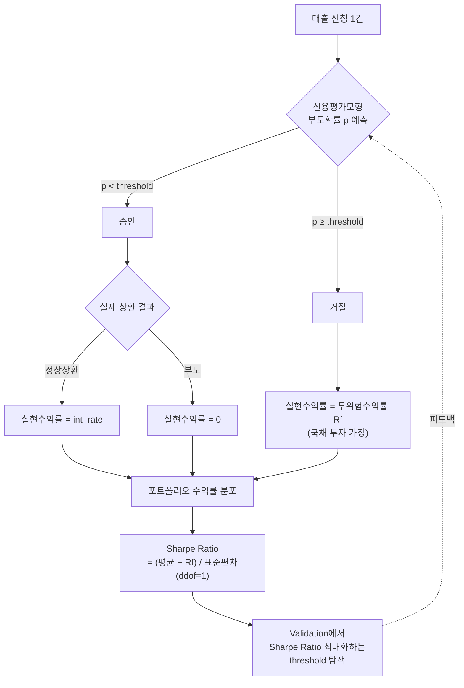

# 아키텍처 개요

## 1. 데이터 파이프라인

> 실선 노드 = 이미 구현/확정된 단계, 점선 노드 = 아직 팀에서 확정하지 않은 계획 단계.
> `P2`~`P7`의 순서는 예시이며 실제 처리 순서·세부 방식은 팀 확정 필요 (`src/preprocessing/AGENTS.md` 참고).
> 거시지표 **수집**(`B3`)은 완료됐으나 대출 데이터와의 **결합**(`P7`)은 미확정이다 —
> lag 개월 수·level/YoY 선택·`issue_d` 더미와의 다중공선성 처리가 남았다
> (`outputs/reports/macro_indicator_selection.md` 6절).
> 무위험수익률(`C4`)은 독립변수가 아니라 Sharpe Ratio 계산(`D2`)에만 쓴다.

## 2. 승인/거절 의사결정 로직 (Sharpe Ratio 최적화)

> Test set은 위 피드백 루프(threshold 재탐색)에 참여하지 않는다 — 확정된 모형·threshold를 그대로 적용해 검증만 한다.

## 참고

이 다이어그램은 단순화된 개요이며, 아래 세부 방법론은 의도적으로 생략했다 — 최신 내용은 각 문서를 참고:
- Threshold 확정 후 Train 전체 재학습, 안정성 검증(30-seed 반복), "전부 승인" 베이스라인 비교: `src/analysis/AGENTS.md`
- 개별 대출 IRR 심화 계산, 대출 간 독립성 문제, 수익률 분포 히스토그램, 사전적·사후적 Sharpe Ratio 구분: `README.md`
