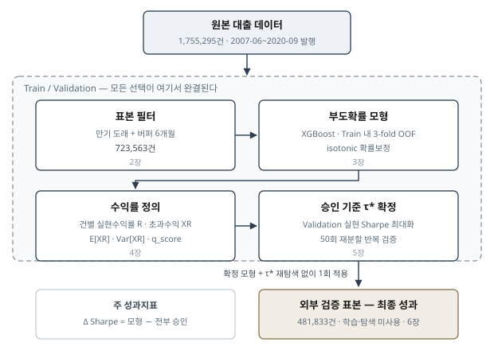
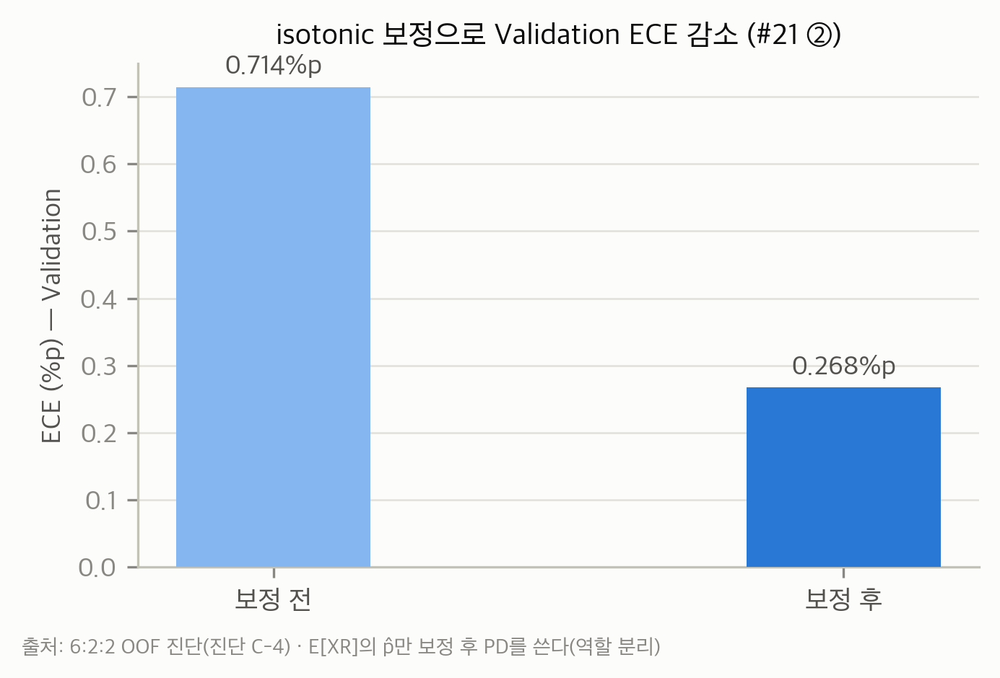
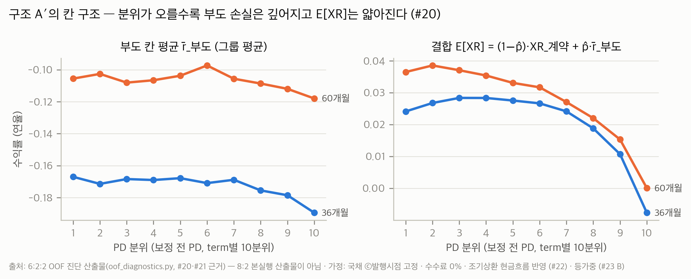
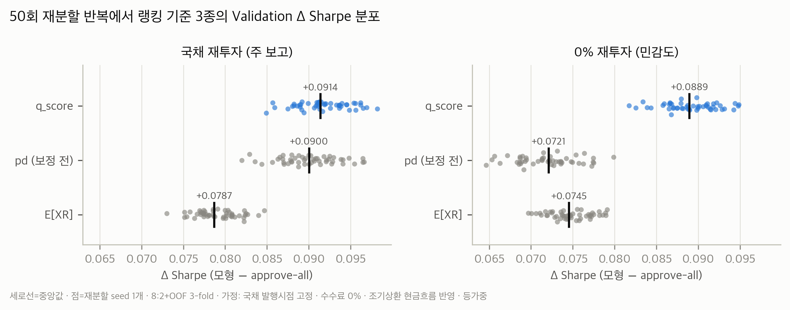
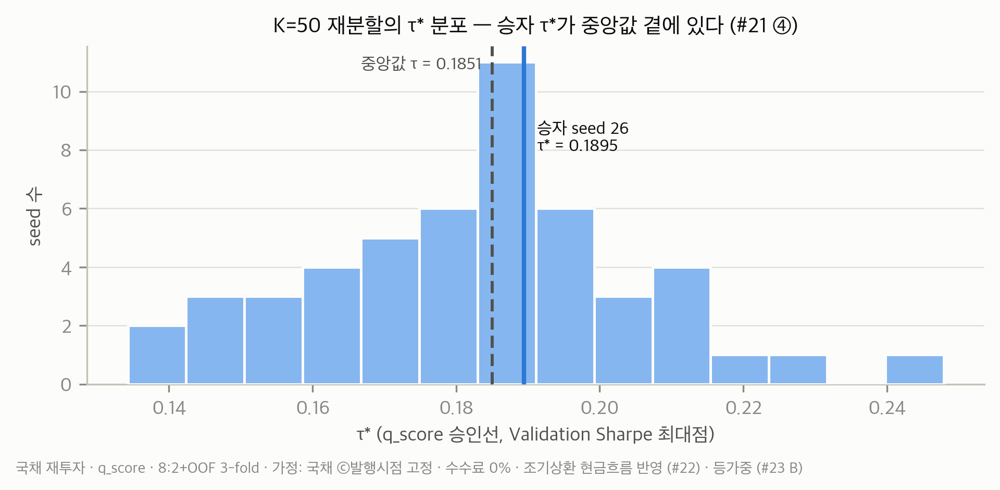
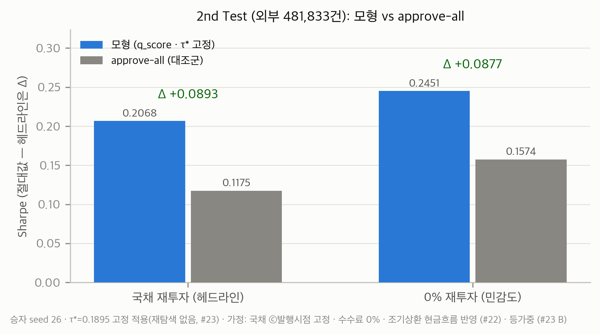
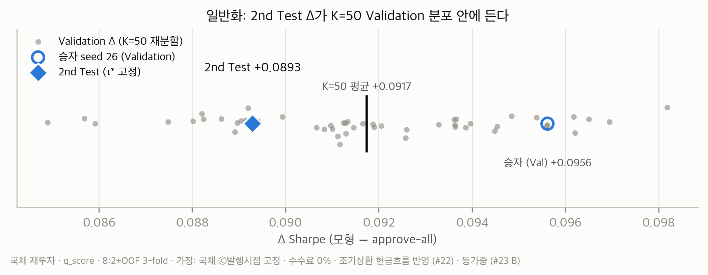

# Lending Club 신용평가모형과 Sharpe Ratio 극대화 승인 전략

**서울대학교 핀테크 전문가 과정 「통계, 데이터 사이언스」 팀 프로젝트 최종 보고서**

- **팀원**: 강권재 · 류성환 · 안예환 · 유명곤 · 이지희 · 최지원
- **제출일**: 2026-07-31
- **재현성**: 본 보고서의 모든 수치는 재현 스크립트와 산출물로 재현할 수 있다
  (부록 B 재현 가이드, 부록 C 전체 구현 코드).

---

## 요약

Lending Club 대출 데이터를 이용해 부도확률(PD)을 예측하는 신용평가모형을 구축하고, 예측
확률에 기반한 대출 승인/거절 전략의 Sharpe Ratio를 극대화했다. 학습과 검증에는 공개 대출
데이터 1,755,295건(2007-06~2020-09 발행) 가운데 만기가 도래해 수익률이 확정된 723,563건을
Train/Validation으로 나누어 사용했다. 최종 평가는 학습·탐색에 한 번도 사용하지 않은 별도
파일(1차 표본과 대출 id가 겹치지 않는다)에 같은 필터를 적용한 481,833건으로 수행했으며, 이
가운데 건별 현금흐름 계산이 가능한 480,997건이 유효 표본이다. 여기에 확정된 모형과 승인
기준을 재탐색 없이 1회 적용한 결과는 다음과 같다.

| 지표 | 값 |
| --- | ---: |
| **Δ Sharpe (모형 전략 − 전부 승인)**, 주 성과지표 | **+0.0893** |
| 모형 전략 Sharpe | 0.2068 |
| 전부 승인(approve-all) 대조군 Sharpe | 0.1175 |
| 상대 개선 | +76% |
| 승인율 | 45.4% |

모형 전략은 전부 승인 대비 Sharpe를 76% 개선했다. Sharpe의 절대 수준은 전략의 성능뿐 아니라
수익률의 측정 규약(연율화·재투자·거절 건 처리)에도 함께 좌우되므로, 본 연구는 모형의
기여분인 Δ Sharpe를 주 성과지표로 보고하고 절대 Sharpe를 병기한다. 벤치마크와 성능 상한은
6.3절에 정리했다. Δ Sharpe는 50회의 재분할 반복에서 seed 간 표준편차 ±0.0031로
안정적이었고, 외부 표본의 결과는 내부 검증 분포의 1σ 안에 들어와 일반화가 확인되었다. 특히
본 연구가 도입한 건별 실현 현금흐름 기반 조기상환 보정은 정상상환 수익률의 과대추정 편향을
제거하면서, 모형의 순 개선 성과인 Δ Sharpe를 보정 전 기준 +0.078에서 +0.0893으로
높였다(6.6절).

**주요어**: P2P 대출, 신용평가모형, 부도확률, 확률보정, Sharpe Ratio, 내생적 투자집합

---

## 목차

**1. 서론**
  1.1 문제 정의: 내생적 투자집합 · 1.2 선행연구와 본 연구의 기여 · 1.3 분석 원칙 ·
  1.4 연구 설계 개요

**2. 데이터 및 전처리**
  2.1 데이터 · 2.2 변수 선택: 사전/사후 구분 · 2.3 표본 필터: 만기 도래 + 버퍼 6개월 ·
  2.4 결측치 처리와 모형 구성 · 2.5 데이터 분할 체계

**3. 부도확률 예측 모형**
  3.1 모형 선택 · 3.2 모형 사양 · 3.3 후보 사양 비교와 `zip_code` 제외 ·
  3.4 OOF 예측과 확률보정 · 3.5 판별력

**4. 수익률과 성과지표의 정의**
  4.1 측정 규약: 연율화와 재투자 가정 · 4.2 부도 건의 손실 크기 ·
  4.3 정상상환 건의 현금흐름과 조기상환 보정 · 4.4 기대 초과수익의 혼합 구조 ·
  4.5 국채 금리의 세 가지 역할과 서비스수수료 · 4.6 승인선 점수: E[XR], Var[XR], q_score ·
  4.7 성과지표: Sharpe Ratio와 Δ Sharpe

**5. 승인 기준(threshold)의 결정과 안정성 검증**
  5.1 threshold 탐색 절차 · 5.2 승인선 랭킹 기준의 선택 · 5.3 50회 반복 재분할 검증 ·
  5.4 최종 모형과 τ\*의 선정 규칙

**6. 최종 결과: 외부 표본 검증**
  6.1 평가 설계 · 6.2 결과 · 6.3 벤치마크와 성능 상한 · 6.4 일반화 성능 확인 ·
  6.5 선행연구와의 비교 · 6.6 절대 Sharpe의 측정 의존성 · 6.7 민감도 분석

**7. 한계 및 향후 과제**
  7.1 한계 · 7.2 향후 과제

**8. 결론**

참고문헌 · 부록 A. 대안 검토 요약 · 부록 B. 재현 가이드 · 부록 C. 전체 구현 코드

---

## 1. 서론

### 1.1 문제 정의: 내생적 투자집합

P2P 대출 플랫폼 Lending Club(이하 LC)의 공개 데이터를 이용해, 투자자 관점에서 개별 대출에
투자(승인)할지를 결정하는 전략을 수립한다. 전략의 성과 기준은 분류 정확도나 AUC가 아니라
**승인한 대출 포트폴리오의 Sharpe Ratio**다.

대출의 수익률은 부도 여부라는 베르누이 확률변수에 좌우되므로, 수익률의 평균과 표준편차는
모두 부도확률 p의 함수다. 따라서 p를 추정하는 도구가 신용평가모형이고, 모형의 예측확률을
승인 기준(threshold, τ)과 연결하는 것이 전략이다. 승인 기준을 엄격하게 하면 소수의 우량
대출만 남아 개별 대출의 비체계적 위험 비중이 커지고, 완화하면 저품질 대출이 포함된다. 승인
기준이 투자 가능 집합 자체를 내생적으로 결정하는 구조이며, 이 트레이드오프의 최적점을
Sharpe Ratio로 탐색한다.

성과지표의 정식 정의는 그 재료인 건별 실현수익률을 정의한 뒤라야 성립하므로 4.7절에 둔다.
성과 보고의 주 성과지표는 모형 전략 Sharpe와 전부 승인 대조군 Sharpe의 차이인
**Δ Sharpe**이며, 절대 Sharpe는 항상 병기하되 모형의 기여분으로 해석하지 않는다.

### 1.2 선행연구와 본 연구의 기여

동일 데이터에서 승인 임계값의 Sharpe 최적화를 다룬 선행연구로 Park et al.[1]이 있다. 본
연구는 같은 문제 설정(임계값이 투자 가능 집합을 내생적으로 결정)에서 출발하되, 결과를 가장
크게 좌우하는 실현수익률의 정의를 독자적으로 설계했다. 본 연구의 기여는 표 1-1의 다섯
가지다.

**표 1-1. 본 연구의 기여**

| 기여 | 내용 | 해당 절 |
| --- | --- | --- |
| 정상상환 건의 건별 현금흐름 직접 계산 | 그룹 평균으로 대체하지 않고 `int_rate`·`term`·`installment`로 건별 계약 현금흐름을 계산해, 총보유수익률 복리 연율화가 상각형 대출에서 만드는 구조적 과소평가를 피한다 | 4.1절, 4.3절 |
| 잔존기간 매칭 국채 재투자 | 매달 수령액의 재투자처를 명시해, 무위험 등가 대출의 초과수익이 정확히 0이 되도록 한다 | 4.1절 |
| 조기상환의 실현 현금흐름 반영 | 실제 회수 시점을 반영해 정상상환 수익률의 과대추정을 제거하고, 계약 기준에서 0이 되던 정상상환분의 분산을 복원한다 | 4.3절 |
| 위험조정 승인 기준 q_score | 기대 초과수익을 그 표준편차로 나눈 점수로 승인선을 그어, 단순 PD 랭킹과 단순 기대수익 랭킹의 약점을 동시에 회피한다 | 4.6절, 5.2절 |
| 외부 표본 1회 검증 체계 | 학습·탐색에 사용하지 않은 별도 파일에 확정 모형과 τ\*를 재탐색 없이 1회 적용한다 | 2.5절, 6장 |

선행연구가 보고한 값은 6.5절에 참고로 싣는다.

### 1.3 분석 원칙

분석 전 과정에서 다음 세 가지 원칙을 유지했다.

1. **승인/거절 기준은 Sharpe Ratio로만 정한다.** AUC 등 분류 지표는 전처리·사양 간 상대
   비교에만 사용하고, 승인 기준 결정에는 사용하지 않는다.
2. **최종 평가 표본으로 모형을 조정하지 않는다.** 모든 비교와 선택은 Train/Validation에서
   완결하고, 최종 평가 표본에는 확정된 모형과 τ\*를 1회만 적용한다.
3. **실현수익률의 가정을 코드에 상수로 고정하지 않는다.** 손실·재투자·수수료 등의 가정은
   계산 모듈에 주입하는 구조로 구현하여, 가정을 변경하면 모형 재학습 없이 통계표와
   threshold만 재계산한다. 산출물에는 가정 라벨이 부착되어 어느 가정의 결과인지 추적된다.

### 1.4 연구 설계 개요

본 연구의 전체 구조는 그림 1-1과 같다. 원본 대출 데이터에서 수익률이 확정된 표본을
걸러내고(2장), 승인 시점 정보만으로 부도확률을 예측하는 XGBoost 모형을 학습한다(3장). 건별
실현수익률과 위험조정 기대수익 점수 q_score를 정의한 뒤(4장), Validation의 실현 Sharpe를
기준으로 승인 기준 τ\*를 확정하고(5장), 학습과 탐색에 사용하지 않은 외부 검증 표본에 1회
적용해 최종 성과를 보고한다(6장). 한계와 향후 과제는 7장에, 결론은 8장에 제시한다.



*그림 1-1. 연구 파이프라인. 모든 선택은 Train/Validation에서 완결하며, 외부 검증 표본은
확정된 모형과 τ\*의 1회 적용에만 사용한다.*

핵심 설계 선택은 표 1-2에 요약했으며, 각 선택의 근거는 해당 장에서 제시한다.

**표 1-2. 연구 설계 요약**

| 구성 요소 | 채택한 설계 | 상세 |
| --- | --- | --- |
| 데이터 | Lending Club 공개 대출 데이터 1,755,295건 × 141열 (2007-06~2020-09 발행) | 2.1절 |
| 표본 필터 | 완결(Fully Paid·Charged Off) + 만기 도래 + 버퍼 6개월, 723,563건 | 2.3절 |
| 설명변수 | 승인 시점에 관측 가능한 사전 변수 101개 (`zip_code` 제외) | 2.2절, 3.3절 |
| 데이터 분할 | Train 578,850 / Validation 144,713 (8:2 층화), 외부 검증 표본 481,833건 별도 | 2.5절 |
| 부도확률 모형 | XGBoost 단일 모형, Train 내 3-fold OOF, isotonic 확률보정 | 3장 |
| 실현수익률 | 건별 실현 현금흐름 + 잔존기간 매칭 국채 재투자, R = (W/P)^(12/T) − 1 | 4장 |
| 승인선 점수 | q_score = E[XR]/√Var[XR] (위험조정 기대 초과수익) | 4.6절, 5.2절 |
| 승인 기준 τ\* | Validation 실현 Sharpe 최대화, 50회 재분할 반복으로 안정성 검증 | 5장 |
| 최종 평가 | 확정 모형과 τ\*를 외부 표본에 재탐색 없이 1회 적용 | 6장 |
| 주 성과지표 | Δ Sharpe (모형 전략 − 전부 승인 대조군) | 4.7절 |

---

## 2. 데이터 및 전처리

### 2.1 데이터

사용한 데이터는 표 2-1의 2종이다.

**표 2-1. 사용 데이터 개요**

| 파일 | 규모 | 용도 |
| --- | --- | --- |
| 학습·검증 원본 | 1,755,295행 × 141열 (2007-06~2020-09 발행) | Train / Validation |
| 외부 검증 파일 | 1,170,198행 × 141열 (1차 표본과 대출 id 무교집합) | 최종 평가 전용. 학습·탐색에 사용하지 않는다 |

분석은 표본 추출 없이 전수로 수행했다. 표본을 추출하면 결측 구조, 발행연도, 부도 여부를
교차하는 검증에서 셀 표본 수가 최소 61건까지 감소해 통계량의 부호가 뒤집히는 것을
확인했다. 규칙을 적용할 대상이 전수이므로 그 근거도 같은 분포에서 산출해야 한다.

부도는 `loan_status = Charged Off`, 정상은 `Fully Paid`로 정의한다. `Default`
268건(2.3절의 표본 필터 통과분 113건, 필터 표본의 0.016%)은 연체 121일 이상이나 상각이
확정되지 않은 단계이므로 부도에 합치지 않고 제외한다. `Current` 등 진행 중 대출도
실현수익률이 아직 존재하지 않으므로 제외하며, 이 단계에서 1,755,295건이 완결
1,117,571건으로 줄어든다.

### 2.2 변수 선택: 사전/사후 구분

정보 누수(leakage)를 차단하기 위해 141개 변수를 사전(pre-approval)과
사후(post-approval)로 전수 분류하고, 승인 시점에 관측할 수 없는 사후
변수(상환이력·연체기록·회수액 등)는 설명변수에서 전부 제외했다.

분류의 기준 관점은 다음과 같다. 본 연구의 의사결정 주체는 LC의 심사자가 아니라 LC 심사를
이미 통과한 대출에 투자할지 결정하는 투자자다. 따라서 `grade`·`sub_grade`·`int_rate`·
`installment`·`funded_amnt` 등 LC 심사 결과로 정해지는 조건변수는 투자 결정 시점에 이미
알려진 값이므로 사전 변수로 분류해 설명변수로 사용한다. 투자자는 LC의 심사 정보를 포함해
관측 가능한 모든 정보를 활용할 수 있다는 것이 이 문제 설정의 전제다.

여기에 후보 사양 비교(3.3절)에서 `zip_code` 1개를 추가로 제외하여 최종 설명변수는
101개다.

### 2.3 표본 필터: 만기 도래 + 버퍼 6개월

표본은 `발행일 + 만기 ≤ 2020-04`, 즉 데이터 스냅샷 시점(2020-10) 기준 만기가 도래하고
6개월의 버퍼가 지난 대출로 제한한다. 결과 표본은 **723,563건**(부도율 16.21%, 발행기간
2007-06~2017-04)이다.

이 필터가 필요한 이유는 완결건만 남기는 규칙이 만드는 선택 편향이다. 만기가 아직 도래하지
않은 대출 가운데 완결된 것은 조기완납이거나 조기부도뿐이므로, 최근 발행 코호트에서 부도가
과대표집된다(seasoning 편향). 실측에서 만기 도래 완결건의 부도율은 16.06%인 반면 만기
미도래 완결건은 24.54%로 8.5%p 차이가 났다. 분할이 랜덤 방식이어서 검증 단계가 이 편향을
걸러내지 못하므로, 표본 필터가 유일한 방어 수단이다. 버퍼 6개월은 연체에서 상각 확정까지
통상 4~5개월이 걸리기 때문이며, 버퍼 없이 만기 기준만 적용하면 상태 미확정인 `Current`가
구간 내 4.14% 남는다(버퍼 적용 시 0.06%). 발행연도 기준의 컷(2017년 이전 발행만 사용 등)은
이미 만기가 도래한 187,821건을 불필요하게 제외하므로, 만기 기준은 같은 수준의 편향 차단을
유지하면서 79,428건을 더 확보한다.

이 선택에는 비용도 있다. 60개월 만기의 비중이 25.1%에서 13.9%로 줄어 만기와 발행연도가
얽힌다(term-vintage 교락). 이 문제는 통합 모형에 `term`을 설명변수로 투입하는 구성으로
다루고(2.4절), 성능은 만기별로 나누어 점검했다. 한편 이 필터는 데이터를 약 39만 건
줄이지만 성과를 낮추지 않았다. 필터 이전의 완결 표본으로 전부 승인 Sharpe를 계산하면
부도율 19.3%, 평균 수익률 +0.14%로 음수(−0.13~−0.22)가 된다.

### 2.4 결측치 처리와 모형 구성

결측값은 전부 NaN 그대로 투입하며, 대체하지 않고 결측 더미도 만들지 않는다. 모형을
XGBoost로 단일화하면서(3.1절) 가능해진 구성이다. 근거는 실측이다. 2016년 이후 금액·개수형
변수의 결측률은 0.01%에 불과하고, 결측이 실제로 남는 변수(`il_util` 등)는 분모가 0인
비율형이어서 0 대체가 틀린 값을 만든다. 결측 처리 스킴 4종을 비교한 AUC 차이는 0.00009로
seed에 따른 편차의 1/15 수준이었다. 다만 2015년 이전 구간에서는 결측이 "계좌가 없다"가
아니라 "수집하지 않았다"를 의미하므로, 이 구간의 0 대체는 어떤 경우에도 타당하지 않다.

표준화·로그변환·구간화·캡핑도 적용하지 않는다. 트리 모형은 값의 순서만 사용하기
때문이다.

만기(36/60개월)는 별도 모형으로 나누지 않고, 통합 모형에 `term`을 설명변수로 투입한다.
만기별 분리 모형은 분리의 기대 이익이 가장 컸던 60개월에서 오히려 판별력이 낮아졌다(AUC
−0.00564, 비교한 5개 seed 전부). 분리하면 60개월 모형이 약 8만 건으로만 학습하는 반면,
신용위험의 기본 패턴은 상품과 무관하게 공통이어서 통합 시 36개월 데이터가 60개월 예측에
전이되기 때문이다.

### 2.5 데이터 분할 체계

Train 578,850건 / Validation 144,713건(8:2)으로 나눈다. 분할 정의는 대출 id와 소속 칸을
대응시킨 매니페스트 파일로 고정하여 모든 분석이 동일한 분할을 공유한다. 분할은 층화 랜덤
방식이다. 시간순 분할은 2015-12부터 수집이 시작된 변수 14개가 Train에서 전부 결측이 되어
사용할 수 없고, 그 목적인 낙관적 평가 방지는 만기 필터(2.3절)가 이미 달성한다.

최종 평가는 1차 표본 밖의 외부 파일로 수행한다(이하 "외부 검증 표본"). 이 파일
1,170,198건에 2.3절과 동일한 완결·만기·버퍼 필터를 적용하면 481,833건이 남는다. 내부에서
Test 칸을 분리하는 대신 외부 파일을 최종 평가에 사용하므로 1차 표본 전량을 학습·검증에 쓸
수 있고, 평가 표본도 1차 표본의 20%를 Test로 떼어낼 때의 144,713건보다 3.3배 크며, 단일
Test 칸에 따르는 우연 변동 문제도 줄어든다.

threshold 안정성 검증을 위해 Train/Validation 재분할을 50회(seed 0~49) 반복한다(5장).
Train 안에서는 3-fold OOF(out-of-fold)로 PD를 산출한다(3.4절). fold 수는 5와의 비교에서 PD
분위 경계의 이전 품질이 동등하게 기준을 충족하고(이탈 0.479%p 대 0.361%p, 기준 0.60%p)
학습 시간을 33% 줄이는 3으로 정했다.

---

## 3. 부도확률 예측 모형

### 3.1 모형 선택

부도확률(PD) 예측에는 XGBoost 단일 모형을 사용한다. 로지스틱 회귀(정칙화 포함), Random
Forest, 그래디언트 부스팅 계열, MLP를 후보로 검토한 결과다.

이 선택의 근거는 두 가지다. 첫째, AUC와 Sharpe의 상관은 약해서(선행연구[1]에서 0.228로
보고) 모형 판별력의 우열이 곧 전략 성과의 우열로 이어지지 않는다. 따라서 모형 종류의
비교에 자원을 투입하기보다 확률의 품질(보정)과 승인 기준 설계에 투자하는 것이 효과적이라고
판단했다. 둘째, XGBoost는 결측 NaN과 범주형 변수를 자체 처리하므로(2.4절) 전처리 경로가
하나로 유지된다. 로지스틱 회귀를 병행하면 대체값·인코딩·표준화·다중공선성 처리를 위한 별도
경로가 추가로 필요하다.

부도 손실의 크기(severity)를 추정하는 2단계 회귀 모형은 사용하지 않으며, 근거는 4.4절에서
제시한다.

### 3.2 모형 사양

최종 모형 사양은 표 3-1과 같다.

**표 3-1. 최종 모형 사양**

| 항목 | 값 |
| --- | --- |
| 설명변수 | 101개 (사전 변수, `zip_code` 제외) |
| 하이퍼파라미터 | `n_estimators=600, learning_rate=0.05, max_depth=6, min_child_weight=5, subsample=0.8, colsample_bytree=0.8` |
| 결측·범주형 | `tree_method="hist"` + `enable_categorical=True`로 자체 처리 |
| OOF | Train 내 3-fold |
| 확률보정 | isotonic regression — 보정 전/후 PD의 역할 분리 적용 (3.4절) |

### 3.3 후보 사양 비교와 `zip_code` 제외

복수의 후보 사양(설명변수 집합 × 하이퍼파라미터)을 동일 분할·동일 seed의 공통 조건에서
비교했다. 비교 규격(CV 평균±sd, OOF PD, 보정 후 Brier/ECE)을 통일해 공정성을 확보했다.

사양 간 성능 차이를 분해한 결과, 유의한 차이는 하이퍼파라미터가 아니라 설명변수 집합에서
나왔고, 그중에서도 `zip_code` 한 개가 사실상 전부였다(CV AUC 기여 +0.008 중 `zip_code`
단독 제외 시 잔여 기여는 0에 가깝다). `zip_code`는 911개 범주의 고카디널리티 변수로
과적합을 일으킨다. 제외 시 비교한 24개 seed 전부에서 성과가 우세했고 Δ Sharpe가 +0.0122
개선되어, 최종 사양은 `zip_code`만 제외한 101개 설명변수로 정했다.

### 3.4 OOF 예측과 확률보정

PD는 Train 안에서 3-fold OOF로 산출한다. 각 대출의 PD는 그 대출을 학습에 사용하지 않은
fold의 모형이 예측한 값이므로, PD 분위 경계와 칸별 통계표(4장)를 Train에서 만들어도 자기
예측으로 자기 통계를 만드는 순환이 발생하지 않는다.

부스팅 확률의 과신을 교정하기 위해 isotonic 회귀로 확률을 보정했다. Validation의 기대 보정
오차(ECE)가 0.714%p에서 0.268%p로, 최악 구간 오차(MCE)가 2.838%p에서 0.751%p로
줄었으며(그림 3-1), AUC 변화는 −0.00002로 순위에 영향이 없다. 보정 오차는 AUC에 나타나지 않지만, 기대수익 식
`E[XR] = (1−p̂)·XR_정상 + p̂·μ_부도`에서 p̂에 (μ_정상−μ_부도) ≈ 20%p가 곱해져 직접
반영되므로, 이 문제에서는 보정 품질이 판별력만큼 중요하다.



*그림 3-1. isotonic 보정 전과 후의 Validation 기대 보정 오차(ECE). 모형 진단 단계의 예비
분석 결과로, 최종 분석과는 분할 설정이 다르다.*

보정 전과 후의 PD는 역할을 나누어 사용한다. isotonic 회귀는 계단함수(step function)여서
PD의 고유값 수를 42.9만 개에서 127개로 줄이므로, 보정 후 PD로 분위를 나누면 칸 인원이 최대
2.10%p 치우친다. 따라서 PD 분위 경계 설정과 승인선 랭킹 정렬에는 연속적인 보정 전(raw)
PD를 사용하고, `E[XR]`·`Var[XR]`에 들어가는 확률값 p̂에만 보정 후 PD를 사용하는 역할 분리
구조를 적용한다(표 3-2).

**표 3-2. 보정 전과 후 PD의 역할 분리**

| 쓰임 | 어느 PD |
| --- | --- |
| PD 분위 경계·배정, 승인선 점수로서의 pd | 보정 전 |
| `E[XR]`·`Var[XR]`에 들어가는 확률값 p̂ | 보정 후 |

### 3.5 판별력

3-fold 평균 AUC는 0.709, 외부 검증 표본 AUC는 0.713으로 외부에서 오히려 소폭 높아 과적합
징후가 없다. AUC는 승인/거절 기준이 아니며(1.3절 원칙 1), 이 수준은 승인 시점 정보만으로
부도를 예측하는 문제의 정보 한계에 가깝다. 이 판별력이 Δ Sharpe의 상한을 결정한다(7장).

---

## 4. 수익률과 성과지표의 정의

Sharpe의 재료인 건별 실현수익률 R_i의 정의가 최적 threshold와 결과 전체를 가장 크게
좌우한다. 본 연구에서 가장 많은 검증이 투입된 부분이다. 이 장은 측정 규약(4.1절)에서
출발해 부도 건(4.2절)과 정상상환 건(4.3절)의 수익률을 각각 정의하고, 둘을 결합한 기대
초과수익(4.4절)과 승인선 점수(4.6절)를 거쳐 최종 성과지표(4.7절)에 이르는 순서로 구성된다.

### 4.1 측정 규약: 연율화와 재투자 가정

건별 실현수익률은 대출이 만들어낸 현금흐름 전체를 만기 시점의 자산으로 환산한 뒤 원금 대비
비율을 연율화하여 정의한다.

```
R = (W/P)^(12/T) − 1,   W = Σ CF_m · F(m, T)
```

(P는 원금, CF_m은 m월 수령액, F(m,T)는 m월 수령액을 잔존기간 T−m 만기 국채로 운용한
성장계수)

이 식에는 두 가지 규약이 들어 있다. 하나는 연율화 방식이고, 다른 하나는 매달 수령한 현금을
어디에 두는지를 정하는 재투자 가정이다. 둘 다 결과를 실질적으로 좌우한다.

연율화는 월별 현금흐름을 직접 계산하는 방식으로 한다. 총보유수익률(HPR)을 복리 연율화하는
방식(`r = (1+HPR)^(12/T) − 1`)은 분할상환(상각형) 구조에서 수익률을 구조적으로 낮춘다.
상각형 대출을 만기까지 보유하면 내부수익률이 계약금리와 일치해야 하는데, 동일 데이터에서
만기를 완주한 정상상환 건의 HPR 연율화 평균은 4.4%로 계약금리 평균 12.6%와 8%p 이상
괴리된다[1]. 위 식은 수령액을 만기 시점 자산 W로 누적한 뒤 연율화하므로 이 왜곡이 없다.

재투자는 매달 수령액을 잔존기간에 맞춘 만기의 국채에 투자한다고 가정한다(만기보유이므로
가격위험이 없다). 이 가정은 R을 평균 +107.5bp 높인다. 그러나 이는 편의(bias)를 추가하는
것이 아니라 제거하는 것이다. rf=2%일 때 금리 2%의 원리금균등·무부도 대출은 국채와
경제적으로 동일하므로 초과수익이 정확히 0이어야 한다. 재투자를 0%로 두는 관례에서는 이
대출의 초과수익이 −0.96%p로 계산되어 국채와 동일한 대출이 거절 판정을 받는 반면, 국채
재투자에서는 정확히 0이 나온다. 0% 관례는 분자의 −rf와 재투자 양쪽에서 기회비용을 이중으로
부과한다.

재투자 가정은 정상·부도 양쪽에 동일하게 적용한다. 따라서 정상상환 수익률에 `int_rate`를
그대로 쓰지 않는다. `int_rate`를 수익률로 쓰는 것은 재투자율 12.6%를 가정하는 것과 같기
때문이다. 재투자 가정이 결론을 바꾸지 않는지는 0% 재투자 결과를 민감도로 병기해
확인한다(6.7절).

### 4.2 부도 건의 손실 크기

부도 건의 손실은 실제 회수 실적을 반영해 추정한다. 실측에서 Charged Off 217,366건의 평균
단순 총수익률(총수령액/원금 − 1, 연율화 전)은 **−45.19%**(중앙값 −49.00%)다. 부도 후에도
그때까지의 납입액과 회수금(recoveries)이 있기 때문이다. 같은 실적을 4.1절의 계약만기 등가
방식으로 연율화하면 성숙 표본의 부도 평균은 −15.2%가 된다 — 두 값은 같은 현금흐름의 다른
표기이므로 인용 시 기준을 함께 밝힌다(이 절의 −45.19%는 연율화 전 기준이다).

부도 건의 현금흐름은 두 갈래로 나누어 배치한다. 정규 수령액 `C_regular = total_pymnt −
recoveries`는 최초 납입월부터 최종 납입월 K까지 배분하고, 순회수액 `C_recovery = recoveries
− collection_recovery_fee`는 최종 납입 6개월 뒤(t = K + 6)에 일시 수령으로 배치한다. 두
항목을 분리하는 것은 회수금이 정상 상환과 발생 시점도 성격도 다르기 때문이다. 6개월은
연체에서 상각 확정까지 통상 4~5개월이 걸린다는 실무 관례를 따른 것으로, 표본 필터의
버퍼(2.3절)와 같은 근거다.

가장 단순한 가정인 원금 전액 손실(수익률 −100%)은 부도 손실을 2배 이상 과대평가해
threshold를 왜곡한다. 가정 간 차이는 작지 않다. 부도율 20%,
금리 12%, rf 2%인 단순 포트폴리오에서 부도 시 수익률을 0% / −45.19% / −100%로 바꾸면
Sharpe가 +1.58 / −0.06 / −0.28로 부호까지 바뀐다.

### 4.3 정상상환 건의 현금흐름과 조기상환 보정

정상상환 건의 수익률은 그룹 평균을 쓰지 않고 `int_rate`·`term`·`installment`·발행시점
국채곡선으로 건별 현금흐름을 직접 계산한다. 부도 건과 달리 개별 정보를 그대로 살리는
이유는 4.4절에서 제시한다.

계약 현금흐름은 만기까지 계약대로 납입한다는 가정인데, 실제로는 Fully Paid 36개월 대출의
66.03%가 조기상환한다. 국채 재투자 가정 아래에서 조기상환은 R을 낮춘다. 금리 12% 대출이
12개월 차에 조기 회수되면 남은 24개월은 약 2%의 국채로 운용해야 하기 때문이다. 계약 기준만
쓰면 정상상환 수익률이 과대추정된다.

본 연구는 건별 실현 현금흐름을 재구성해 이를 보정했다. 월별 납입액을 재구성하고 실제 회수
시점을 반영한 뒤, 만기까지의 잔여기간은 국채 성장·역할인으로 처리한다. 실측 보정폭은
36개월 +1.06%p, 60개월 +2.24%p의 과대추정 제거다. 이 보정은 정상상환분의 칸별 분산
var_정상,d도 복원한다. 계약 기준만 쓰면 정상상환의 분산이 0이 되어 위험 항이 부도만
반영하게 된다. 이 보정은 절대 Sharpe를 낮추고, 모형의 순 개선 성과인 Δ Sharpe는 보정 전
+0.078에서 보정 후 +0.0893으로 높인다. 상세 분해는 6.6절에서 다룬다.

### 4.4 기대 초과수익의 혼합 구조

기대 초과수익은 부도분과 정상상환분을 서로 다른 방식으로 추정하는 혼합 구조로 정의한다.

```
E[XR_i] = (1 − p̂_i) · XR_정상,i  +  p̂_i · r̄_부도,d(i)
              (건별 계산)            (그룹 평균: PD분위 × 만기 칸)
```

부도분은 PD 분위 그룹 평균 r̄_부도,d로 추정한다. 그룹 축은 PD 10분위 × 만기(36/60개월)다.
만기에 따라 현금흐름 기간이 다르고, 만기 필터로 60개월의 구성이 변했기 때문이다. 분위
경계는 만기별로 따로 만든다. 60개월은 위험군이어서 공통 분위로 나누면 저PD 칸이 거의 비기
때문이다.

두 항을 비대칭으로 다루는 근거는 정보의 비대칭이다. 정상상환 수익률은 승인 시점에 거의
결정론적으로 계산되며 불확실한 것은 조기상환 시점뿐이다. 반면 부도 손실은 회수 프로세스,
소송 시점, 채권 매각 조건처럼 데이터에 없는 요인이 지배한다. 계산 가능한 쪽까지 그룹
평균으로 대체하면 개별 정보를 잃는다. 실측도 이 구성을 지지한다. 같은 (만기, PD분위) 칸
안의 `int_rate` 산포는 중앙값 2.85%p로, 양쪽 모두 그룹 평균을 쓰면 분위 안에서 대출을
차별화할 수단이 사라진다. 반대로 부도 칸 평균 μ_부도는 PD 분위에 거의 무관했다(그림 4-1,
분위 간 폭 2.2%p, 만기 간 6.1%p). 부도 손실이 PD가 담은 정보로 설명되지 않으므로, 부도 서브셋에 회귀
모형을 추가하는 2단계(hurdle) 구조는 잡음을 추정치에 배분할 뿐 정보를 더하지 않는다고
판단해 사용하지 않는다.



*그림 4-1. PD분위 × 만기 칸별 부도 칸 평균 수익률과 결합 기대 초과수익 E[XR]. 부도 칸
평균은 분위가 오를수록 낮아지고 결합 E[XR]는 고분위에서 급락하며, 승인선이 그어지는 지점이
이 급락 구간이다. 모형 진단 단계의 예비 분석 결과로, 최종 분석과는 분할 설정이 다르다.*

### 4.5 국채 금리의 세 가지 역할과 서비스수수료

국채 금리는 세 가지 역할로 분리해 각각 다른 값을 사용한다(표 4-1).

**표 4-1. 국채 금리의 세 가지 역할**

| 역할 | 쓰는 금리 |
| --- | --- |
| rf (초과수익률 XR = R − rf의 차감항) | 발행시점 × 만기매칭 GS3(3년물)/GS5(5년물) |
| 계약 현금흐름 재투자 (점수용 XR_계약·E[XR]) | 발행시점 고정 GS3/GS5 곡선 (승인 시점에 관측 가능하므로 누수가 없고 결정론적이다) |
| 실현 현금흐름 재투자·역할인 (조기상환 반영 R·칸별 통계표) | GS1M(1개월물) 실제 경로 |

세 금리는 공시 형태가 달라 각각 다른 식으로 월 단위로 환산한다. GS3·GS5는 연율 표기이므로
월율을 `(1 + r)^(1/12) − 1`로 구한다. GS1M은 반년 복리 관례의
채권등가수익률(bond-equivalent yield)로 공시되므로 12로 나누지 않고, 반년 복리를 풀어
`(1 + GS1M/200)^(1/6) − 1`로 월 등가수익률을 만든다. 두 식을 섞으면 월율이 최대 수 bp
어긋난다.

부도 건에서 발행시점 고정 금리와 실제 경로 금리의 XR 차이는 36개월 −0.0002, 60개월
+0.0034로 거의 같음을 실측으로 확인했다. 차이는 대부분 조기상환에서 발생한다.

투자자 서비스수수료(약 1%)는 반영하지 않는다(0%). 수수료는 모형 전략과 전부 승인 양쪽에
같은 방향으로 작용해 주 성과지표인 Δ Sharpe에는 상쇄적이며, 한계로 명시한다(7장).

### 4.6 승인선 점수: E[XR], Var[XR], q_score

승인선 점수로 쓰는 위험조정 기대 초과수익은 다음과 같이 정의한다.

```
q_i = E[XR_i] / √Var[XR_i]
Var[XR_i] = (1−p̂)·var_정상 + p̂·var_부도 + p̂(1−p̂)·(μ_정상 − μ_부도)²
```

분산에서는 교차항이 지배적이다. 예시(p=0.10, μ_정상=+5%/sd 3%, μ_부도=−40%/sd 20%)에서
교차항이 총분산의 79%를 차지한다. 이 항을 빠뜨리면 표준편차가 15.2%에서 6.9%로 축소되고
p(1−p)에 비례한 편향이 생겨 랭킹 순서가 바뀐다.

부도분 분산 var_부도는 표본이 작은 칸에서 불안정하므로(상대오차 ≈ √(2/(n−1))), 분산에는
평균보다 엄격한 최소 표본수를 요구하고 pooled 분산으로 축소추정한다. 분산이 과소추정된
칸이 체계적으로 승인되는 선택편향을 막기 위해서다.

PD 분위 경계는 Train OOF PD로 만들어 Validation과 최종 평가 표본에 그대로 적용한다.
표본마다 분위를 다시 나누면 threshold가 "PD 얼마 이하"가 아니라 "그 표본의 상위 몇 %"가
되어 다른 표본으로 이전할 수 없기 때문이다. Validation에서 분위 인원의 이탈은 0.479%p로
기준(0.60%p) 이내였다.

### 4.7 성과지표: Sharpe Ratio와 Δ Sharpe

앞 절들에서 정의한 건별 실현수익률 R_i를 재료로, 전략의 성과지표를 다음과 같이 정의한다.

```
Sharpe = (1/N · Σ XR_i) / σ_XR     (N = 승인·거절을 포함한 전체 평가 표본 수)

XR_i = R_i − rf_i   (승인 건: 건별 실현수익률 − 발행시점·만기매칭 국채수익률)
     = 0            (거절 건)
```

여기서 σ_XR은 XR_i의 표본표준편차(ddof=1), 즉 대출 건별 횡단면 산포다. 거절한 대출은
표본에서 제외하지 않고 XR=0으로 분모의 전체 표본 N에 유지한다. 거절한 자금은 무위험
자산(국채)에 투자되어 초과수익이 정확히 0이 되는 경제적 상황을 반영한 것이며, 동시에
보수적 설계이기도 하다. 거절 건을 제외하면 승인율을 낮출수록 Sharpe가 자동으로 상승해
지표가 착시 상승하는 편향이 생기기 때문이다(5.1절).

성과 보고의 주 성과지표는 **Δ Sharpe**, 즉 모형 전략 Sharpe와 전부 승인 대조군 Sharpe의
차이다. 실현수익률 계산에 들어가는 가정(4.1절의 재투자 등)은 모형 전략과 대조군을 같은
방향으로 움직이므로, 절대값에는 가정의 효과가 섞이고 모형의 기여는 그 차이에 남는다. 절대
Sharpe는 항상 병기하되 모형의 기여분으로 해석하지 않는다.

승인선 점수 q_score(4.6절)와 성과지표 Sharpe는 역할이 다르다. q_score는 승인선을 어디에
그을지 정렬하는 데만 쓰는 기대값 기반 점수이고, Sharpe는 그렇게 승인한 결과를 실현
XR로 측정하는 지표다. 이 분리는 5.1절의 탐색 절차에서 그대로 유지된다.

---

## 5. 승인 기준(threshold)의 결정과 안정성 검증

### 5.1 threshold 탐색 절차

탐색 절차는 네 가지 설계로 구성된다. 첫째, Sharpe는 점수(기대값)가 아니라 Validation의
실현 XR로 계산하고, 점수는 승인선을 긋는 데만 사용한다. 기대값으로 성과를 측정하면 모형의
예측이 평가 기준에 재사용되는 순환이 생기기 때문이다. 둘째, 거절 건은 XR=0으로 표본에
남긴다. 제외하면 승인율을 낮출수록 분모가 줄어 Sharpe가 자동으로 상승하며, 실측으로 +0.24
높아진다. 셋째, 격자 탐색을 쓰지 않는다. 점수로 정렬한 뒤 승인 건수 k=1..n 전부를
누적합으로 평가하므로 격자 해상도 때문에 최적점을 놓치지 않는다(전수 탐색과 5e-16까지
일치함을 검증했다). 넷째, 칸별 통계표와 분위 경계는 Train에서만 만들어 Validation에
적용한다.

### 5.2 승인선 랭킹 기준의 선택

승인선을 긋는 정렬 기준으로는 q_score(4.6절)를 사용한다. 후보 세 가지(표 5-1)를 5.1절의
동일한 절차로 비교한 결과다. 세 기준은 같은 중간 테이블에서 정렬만 바꾸면 산출되므로 추가
학습 없이 비교할 수 있고, 비교는 Validation에서만 수행했다.

**표 5-1. 승인선 랭킹 기준 후보 3종**

| 기준 | 성격 | 약점 |
| --- | --- | --- |
| pd (보정 전 PD) | 위험만 본다 | E[XR]이 PD에 비단조여서(그림 4-1) 수익성 있는 중위험 대출까지 거절해 평균이 낮다 |
| E[XR] | 기대수익만 본다 | 분산을 반영하지 않아 승인 포트폴리오의 표준편차가 가장 크다 |
| **q_score = E[XR]/√Var[XR]** | 위험조정 기대수익 | 두 극단의 약점을 모두 회피한다 |

pd 오름차순 승인이 최선이 아닌 이유는 E[XR]이 PD에 비단조이기 때문이다. 최우량 분위는
부도율이 낮지만 약정 금리도 낮아 기대 초과수익이 오히려 낮고, E[XR]의 정점은 중위험
분위(36개월 3~4분위, 60개월 2분위)에 있다. q_score는 이 수익성과 위험의 상충관계를 하나의
위험조정 지표로 통합해 단순 PD 랭킹과 단순 E[XR] 랭킹의 약점을 동시에 회피한다. q_score의
우위는 단일 분할 탐색에서 두 분할 × 두 재투자 가정의 4개 조합
전부에서 재현되었고(2위와 3위의 순서는 분할에 민감했다), 50회 반복 검증(5.3절)에서 최종
확인되었다.

### 5.3 50회 반복 재분할 검증

한 번의 분할에 따른 우연 변동이 결론을 만든 것이 아님을 확인하기 위해, Train/Validation
재분할(seed 0~49)마다 3-fold OOF, 확률보정, 칸별 통계표, threshold 탐색의 전 과정을
반복했다. Validation 기준 요약은 표 5-2 및 그림 5-1과 같다.

**표 5-2. 50회 재분할 반복 결과 요약 (Validation 기준)**

| 재투자 | 기준 | τ\* 중앙값 ± sd | Sharpe 평균 ± sd | Δ Sharpe 평균 ± sd | 승인율 |
| --- | --- | --- | --- | --- | --- |
| **국채(주 보고)** | **q_score** | **0.1851 ± 0.0233** | 0.2071 ± 0.0030 | **+0.0917 ± 0.0031** | 46.8% |
| 국채 | pd (보정 전) | 0.1348 ± 0.0112 | 0.2053 ± 0.0034 | +0.0900 ± 0.0035 | 48.2% |
| 국채 | E[XR] | 0.0104 ± 0.0011 | 0.1944 ± 0.0028 | +0.0791 ± 0.0025 | 59.8% |
| 0%(민감도) | q_score | 0.2013 ± 0.0189 | 0.2441 ± 0.0032 | +0.0891 ± 0.0031 | 51.9% |
| 0% | pd (보정 전) | 0.1510 ± 0.0125 | 0.2268 ± 0.0034 | +0.0718 ± 0.0035 | 55.5% |
| 0% | E[XR] | 0.0131 ± 0.0012 | 0.2297 ± 0.0029 | +0.0747 ± 0.0024 | 63.1% |



*그림 5-1. 50회 재분할 반복에서 랭킹 기준 3종의 Validation Δ Sharpe 분포.*

q_score의 우위는 반복 검증에서 재확인되었다. 국채·0% 재투자 양쪽에서 Δ Sharpe 1위이며, 0%
재투자에서는 격차가 더 크다(+0.0891 대 pd 기준 +0.0718). 절차도 안정적이다. Δ의 seed 간
표준편차 ±0.0031은 재분할의 우연 변동으로 결론이 뒤집힐 크기가 아니다.



*그림 5-2. 50회 반복의 τ\* 분포. 최종 선정 모형의 τ\*(0.1895)는 분포의 중앙값(0.1851)에
근접하며 극단값이 아니다.*

### 5.4 최종 모형과 τ\*의 선정 규칙

50개의 반복은 같은 사양에 분할만 다르므로, 선정의 단위는 (seed, 분할, 모형, 보정기, 분위
경계, 칸별 통계표, τ\*)의 한 묶음이다. 50회 중 Validation Sharpe가 가장 높은 seed 26의
묶음을 동일하게 재현해 최종 모형으로 삼았다(표 5-3).

**표 5-3. 최종 선정 모형 (seed 26)**

| 항목 | 값 |
| --- | --- |
| τ\* | 0.1895 (50회 중앙값 0.1851 병기) |
| Validation Sharpe / Δ | 0.2126 / +0.0956 (approve-all 0.1170) |
| 승인율 | 45.3% |
| 3-fold 평균 AUC | 0.709 |

최고값 선택은 분할의 우연 변동을 포함하므로, 50회의 τ\* 중앙값(그림 5-2)을 적용한
median_tau 결과를 함께 산출해 선택 규칙이 만드는 낙관분을 추적한다(6장에서 두 값의 차이가 무시 가능한
수준임이 확인된다). Validation 최고값 0.2126은 성과로 인용하지 않으며, 최종 성과는 외부
표본의 값이다.

---

## 6. 최종 결과: 외부 표본 검증

### 6.1 평가 설계

선정된 모형(seed 26)과 τ\*=0.1895를 고정한 채, 학습과 탐색에 한 번도 사용하지 않은 외부
파일(1차 표본과 대출 id가 겹치지 않음)에 1회 적용했다. 동일한 전처리와 필터를 통과한
481,833건(부도율 16.20%) 중 현금흐름 계산이 가능한 480,997건이 유효 표본이다. 제외된
836건(0.17%)은 전건이 동일 사유다 — 관측된 마지막 납입액이 정규 수령 총액(총납입액 −
회수액)을 초과해 균등배분식 월별 현금흐름 분해가 성립하지 않는 건으로(정보 결측이나 국채
금리 커버리지 사유는 0건), 모형이나 승인 판단과 무관한 데이터 정합성에 따른 기계적 제외다.
원본 파일은 수정 없이 보존되며, 제외 내역은 1차 표본의 같은 기준 제외 1,210건과 함께
사유·상태·만기별 감사 테이블로 남겨 검증이 가능하다(부록 B).

### 6.2 결과

외부 검증 표본의 평가 결과는 표 6-1과 같다.

**표 6-1. 외부 검증 표본 평가 결과**

| variant | 재투자 | τ | 승인율 | Sharpe | approve-all | Δ Sharpe |
| --- | --- | ---: | ---: | ---: | ---: | ---: |
| **winner_tau (주 보고)** | **국채** | **0.1895** | **45.4%** | **0.2068** | **0.1175** | **+0.0893** |
| median_tau | 국채 | 0.1851 | 46.2% | 0.2067 | 0.1175 | +0.0893 |
| 사후 최적 τ (진단 전용) | 국채 | 0.1633 | 50.2% | 0.2081 | 0.1175 | +0.0907 |
| winner_tau | 0% | 0.1895 | 53.7% | 0.2451 | 0.1574 | +0.0877 |
| median_tau | 0% | 0.1851 | 54.6% | 0.2449 | 0.1574 | +0.0875 |
| 사후 최적 τ (진단 전용) | 0% | 0.2074 | 50.1% | 0.2457 | 0.1574 | +0.0883 |

사후 최적 τ는 외부 표본을 보고 고른 진단 참고용 값으로 성과로 인용하지 않는다. 같은 q_score
랭킹 안에서 컷만 다시 고른 값이므로, 부도 여부를 미리 아는 완전예지 오라클(6.3절)과는 다른
개념이다. 최종 공식 성과는 Validation에서 사전에 고정한 winner_tau의 결과(Δ Sharpe
+0.0893)만 인용한다.



*그림 6-1. 외부 검증 표본에서 모형 전략과 전부 승인 대조군의 Sharpe 비교.*

최종 결과는 **Δ Sharpe +0.0893**(모형 0.2068, 전부 승인 0.1175, 상대 개선 +76%), 승인율
45.4%다(그림 6-1).

### 6.3 벤치마크와 성능 상한

모형 전략의 성과를 읽으려면 이 지표에서 도달 가능한 범위를 알아야 한다. 같은 외부 검증
표본에 네 가지 기준을 동일한 방식으로 계산했다(표 6-2).

**표 6-2. 외부 검증 표본의 벤치마크 비교 (국채 재투자)**

| 전략 | 승인율 | 평균 XR | XR 표준편차 | Sharpe | Δ Sharpe |
| --- | ---: | ---: | ---: | ---: | ---: |
| 전부 국채 (모두 거절) | 0.0% | 0.0000 | 0.0000 | 정의되지 않음 | — |
| 전부 승인 (대조군) | 100.0% | 0.0115 | 0.0978 | 0.1175 | 0 |
| **모형 (τ\*=0.1895)** | **45.4%** | **0.0105** | **0.0509** | **0.2068** | **+0.0893** |
| 상태 Oracle (정상상환 건만 승인) | 83.8% | 0.0377 | 0.0264 | 1.4294 | +1.3120 |
| 실현 XR>0 Oracle (초과수익 양수만 승인) | 84.8% | 0.0383 | 0.0261 | 1.4698 | +1.3523 |

전부 국채는 승인 건이 없어 초과수익과 그 산포가 모두 0이므로 Sharpe가 정의되지 않는다.
위험도 초과수익도 지지 않는 기준점으로만 읽는다.

두 오라클은 승인 시점에 알 수 없는 정보를 사용한다. 상태 Oracle은 부도 여부를 미리 알고
정상상환 건만 승인하고, 실현 XR>0 Oracle은 건별 실현 초과수익의 부호를 미리 알고 양수인
건만 승인한다. 후자가 조금 높은 것은 정상상환 건 중에도 초과수익이 음수인 건이 있고 부도
건 중에도 양수인 건이 있기 때문이며, 두 오라클의 승인율 차이 1.0%p가 그 크기다.

전부 승인(0.1175)에서 상태 Oracle(1.4294)까지의 구간에서 모형이 회수한 몫은 6.8%이며, 이
비율의 상한은 모형 판별력(AUC 0.71)이라는 정보 한계가 결정한다(3.5절, 7.1절). 오라클의
Sharpe도 1.43 수준에 그친다는 점은 이 지표의 눈금이 시계열 Sharpe와 다르다는 것을 함께
보여준다(6.6절).

### 6.4 일반화 성능 확인

세 가지 기준으로 일반화를 점검했으며 모두 기준을 충족한다.

1. **분포 기준**: 외부 표본 Δ(+0.0893)는 50회 Validation 분포(+0.0917±0.0031)의 아래쪽 1σ
   안에 있다(그림 6-2). 선정 모형 자신의 Validation Δ(+0.0956)보다 0.0063 낮은 것은 50개 중 최댓값을
   고른 선택 편향의 예상된 되돌림이다(외부 표본 n=48만 기준 Sharpe의 추정 표준오차는
   ±0.0015다).
2. **τ 이전 품질**: 사후 최적 τ와의 격차는 −0.0014로, Validation에서 정한 τ\*가 외부
   표본에서도 거의 최적점이다. winner_tau와 median_tau의 차이는 Δ 기준 0.00002로, 선정
   규칙의 낙관분은 무시할 수 있는 수준이다.
3. **판별력 이전**: 외부 표본 AUC 0.713은 학습 fold AUC 0.709와 같은 수준으로, 외부
   표본에서 성능 저하가 없다.



*그림 6-2. 50회 반복의 Validation Δ Sharpe 분포와 외부 표본 Δ Sharpe의 위치.*

### 6.5 선행연구와의 비교

같은 데이터에 같은 계열의 지표를 적용한 선행연구[1]의 보고값은 표 6-3과 같다.

**표 6-3. 선행연구가 보고한 값**

| 기준 | Sharpe | approve-all | 비고 |
| --- | ---: | ---: | --- |
| 선행연구 [1] (동일 데이터·동일 지표 계열) | 0.0919 | −0.1536 | AUC 0.7196, 승인율 26.9%, 완전예지 오라클 0.9658 |
| 본 연구 (외부 검증 표본) | 0.2068 | +0.1175 | AUC 0.7126, 승인율 45.4% |

선행연구는 수익률 연율화(총보유수익률의 복리 연율화, 4.1절)와 거절 건 처리의 관례가 본
연구와 달라 수치를 직접 비교하지 않는다. 같은 문제 설정에서 보고된 값의 규모를 보이는
참고 자료로만 싣는다.

### 6.6 절대 Sharpe의 측정 의존성

절대 Sharpe는 전략의 성능과 4장의 측정 규약에 함께 좌우되므로, 규약을 밝히지 않은 절대
수준끼리의 비교는 성립하지 않는다. 조기상환 보정(4.3절)이 그 예다. 같은 외부 표본·같은
재투자 가정에서 보정 전 계약 현금흐름으로 계산하면 모형 0.300, 전부 승인 0.222이고, 보정
후에는 0.207과 0.117이다. 모형과 무관한 전부 승인이 함께 하락하므로 이 차이는 측정 방식의
변경에서 오며, 모형 기여분 Δ는 +0.078에서 +0.089로 움직인다. 거절 건을 XR=0으로 분모에
남기는 처리(4.7절)도 같은 성격으로, 이 처리는 절대 수준을 약 0.24 낮춘다(5.1절).

지표의 정의도 수준을 결정한다. 본 연구의 Sharpe는 대출 건별 횡단면 산포를 분모로 쓰고 그
분모는 부도 여부라는 베르누이 리스크의 교차항이 지배하므로(총분산의 약 79%, 4.6절),
투자자가 수만 건에 분산해 소거하는 고유리스크가 그대로 남는다. 오라클의 Sharpe도 1.43
수준에 그치는 것이 이 눈금의 결과다(6.3절). 따라서 이 값은 주식 지수 수익률의 시계열
Sharpe와 정의가 달라 직접 비교할 대상이 아니며, 본 연구가 모형의 기여분인 Δ Sharpe를 주
성과지표로 두는 이유도 여기에 있다(4.7절). 분산투자 효과를 반영한 포트폴리오 단위 Sharpe의
병기는 향후 과제로 남긴다(7.2절).

### 6.7 민감도 분석

결론이 가정에 의존하지 않음을 세 가지로 확인했다. 재투자 가정을 0%로 바꾸어도 Δ는
+0.0877로 유지된다(국채 +0.0893). 재투자 가정은 모형 전략과 대조군을 같은 방향으로
움직이므로 Δ가 절대값보다 가정에 안정적이며, 주 성과지표를 Δ로 두는 이유가 이 구조다. τ
선택 규칙을 winner_tau에서 median_tau로 바꾸어도 차이는 Δ 기준 0.00002다. 가중 방식은
등가중(대출 1건 = 1표본)이 기준이며, 투자 금액 관점의 금액가중(`funded_amnt` 가중)은 병기
대상으로 정했고 산출은 후속 작업이다(7장).

---

## 7. 한계 및 향후 과제

### 7.1 한계

본 연구의 한계는 표 7-1과 같다.

**표 7-1. 한계 요약**

| 항목 | 내용 |
| --- | --- |
| 모형 판별력 | AUC 0.71 수준으로, 승인 시점 정보만으로 부도를 예측하는 문제의 정보 한계에 가깝다. 이것이 Δ Sharpe의 상한을 결정한다 |
| 거시 환경 통제 부재 | 거시경제 변수를 사용하지 못했다. 표본 내 실업률과 발행연도의 상관이 −0.911로 거시지표가 사실상 발행연도의 대리변수이며, 원본의 91.7%가 2013~2019년 경기 회복 국면에 집중 발행되어 경기 순환의 양방향이 관측되지 않는다(부록 A). 침체기를 포함한 표본에서는 결론이 다를 수 있다 |
| 투자자 서비스수수료 미반영 | 약 1%의 수수료를 0%로 두었다. 모형·대조군에 상쇄적으로 작용해 Δ에는 영향이 제한적이나 절대 수준에는 반영되지 않았다 |
| 부도 손실의 그룹 평균 의존 | 칸별 조건부 수익률이 Train 경험분포에 의존한다. 축소추정으로 완화했으나 근본적으로는 데이터에 없는 회수 프로세스 정보의 한계다 |
| 거시지표 개정치 사용 | 수집한 FRED 시계열은 최신 개정치로, 당시 실시간 발표값(vintage)이 아니다. 채택하지 않아 최종 결과와는 무관하나 탐색 분석의 한계로 기록한다 |
| 금액가중 병기 미산출 | 등가중 기준은 확정했으며, `funded_amnt` 가중 병기는 후속 작업이다 |
| 횡단면 Sharpe의 해석 | 분산투자 효과가 반영되지 않는 지표다(6.6절). 실무 투자자 관점의 포트폴리오 단위 Sharpe 병기가 유익하다(7.2절) |

거시경제 변수는 실업률(UNRATE), 신규 실업수당 청구(ICSA), 장단기 금리차(GS10−GS2), CPI의
4종을 수집·검증까지 진행했으나 사용하지 않았다. 4개 지표 모두 부도율과 이론과 반대 부호로
나타났고(실업률 4분위별 부도율이 21.16%에서 17.27%로 역방향), 발행연도를 고정해도 부호가
유지되어 통계적 처리로 해소되지 않았다. 원인은 지표가 아니라 위 표에 적은 표본 구조에
있다.

### 7.2 향후 과제

효과 대비 비용 순으로 세 계층이다.

1. **모형 성능 개선(우선순위 1)**: 파생 변수 생성(FICO 변화량, 비율·상호작용 변수),
   체계적 하이퍼파라미터 탐색(현행은 수동 고정값), 모형 앙상블의 순서로 진행한다.
   `zip_code` 제외 하나가 Δ +0.0122를 만든 결과는 설명변수가 가장 효율적인 개선 지점임을
   보여준다.
2. **전략 구조 확장**: 이진 승인/거절을 연속 배분(투자 비중 w_i ∝ E[XR_i]/Var[XR_i], 접선
   포트폴리오 논리)으로 확장하면 이론상 항상 우세하나, 승인/거절 전략이라는 문제 정의
   자체의 확장이므로 별도 연구 과제로 남긴다. 만기별 threshold 분리도 후보다.
3. **보고 방식 보강**: 월별 vintage 코호트로 묶은 포트폴리오 단위 Sharpe를
   병기한다(고유리스크가 분산으로 소거된 실무 관점의 보조 지표). 다만 주 성과지표는
   교체하지 않으며, 거절 건 제외(+0.24)처럼 지표를 상향시키는 방식은 채택하지 않는다.

어느 경우든 외부 평가 표본으로 모형이나 threshold를 조정하는 것은 본 연구의 평가 원칙상
허용되지 않는다. 그 순간 보고 수치가 사후적 Sharpe가 되어 의미를 잃는다.

---

## 8. 결론

본 연구는 Lending Club 대출 데이터에서 부도확률 예측 모형(XGBoost, 외부 표본 AUC 0.713)과
위험조정 승인 기준(q_score, τ\*=0.1895)을 결합한 대출 승인 전략을 구축하고, 학습과 탐색에
사용하지 않은 외부 검증 표본 481,833건(유효 평가 480,997건)에서 Δ Sharpe +0.0893(모형
0.2068, 전부 승인 0.1175, 상대 개선 +76%, 승인율 45.4%)을 확인했다.

분석의 함의는 세 가지다. 첫째, 이 문제의 성과는 분류 지표가 아니라 실현수익률의 정의가
좌우한다. 부도 손실을 실제 회수 실적으로 추정하고(연율화 전 −45.19%) 조기상환을 건별 실현
현금흐름으로 보정하는 선택이 threshold와 성과의 크기를 결정했으며, 같은 전략도 측정 방식에
따라 절대 Sharpe가 0.300에서 0.207까지 달라졌다(6.6절). 둘째, 위험조정 점수 q_score는 단순
PD 랭킹보다 일관되게 우세했다. 기대 초과수익이 PD에 비단조인 구조에서, 위험만 보는 기준은
수익성 있는 중위험 대출까지 거절해 평균을 낮춘다(5.2절). 셋째, 모형의 개선분은 50회 재분할
반복과 외부 표본에서 안정적으로 재현되어(6.4절), 결과가 특정 분할이나 표본의 우연 변동에
의존하지 않는다.

성과의 상한은 모형 판별력(AUC 0.71)이라는 정보 한계가 결정한다. 서비스수수료 미반영을
포함한 한계와 향후 과제는 7장에 정리했다.

---

## 참고문헌

[1] Park, J. J., Moon, J., Yu, H., Lee, H., Jeong, H., Choi, M. and Hwang, H. (2026),
"Portfolio return optimization under an endogenous investment set: evidence from P2P lending",
*Journal of Derivatives and Quantitative Studies: 선물연구*, Vol. 34, No. 2, pp. 113–127,
doi: 10.1108/JDQS-02-2026-0013.

[2] Lending Club 공개 대출 데이터 (2007-06~2020-09 발행분) 및 LC Data Dictionary, 수업 배부
자료 (2026-07 수령).

[3] FRED (Federal Reserve Economic Data), https://fred.stlouisfed.org — GS3·GS5·GS1M
국채수익률, UNRATE·ICSA·GS10·GS2·CPIAUCSL 거시지표 시계열 (2026-07 접근).

---

## 부록 A. 대안 검토 요약

본문에서 채택한 방법마다 검토한 대안과 판단 근거를 요약한다. 수치는 모두 본 데이터에서의
실측이다.

**표 A-1. 대안 검토 요약**

| 주제 | 검토한 대안 | 실측 결과 | 판단 (관련 절) |
| --- | --- | --- | --- |
| 부도 손실 가정 | 원금 전액 손실(−100%) | Charged Off 평균 단순 총수익률(연율화 전) −45.19%로, 손실을 2배 이상 과대평가 | 미채택 (4.2절) |
| 부도 손실 추정 | 부도 서브셋 2단계(hurdle) 회귀 | 부도 손실이 PD 분위에 거의 무관 (분위 간 폭 2.2%p, 만기 간 6.1%p) | 미채택 (4.4절) |
| 모형 종류 | 로지스틱 회귀 병행 | 대체값·인코딩·표준화의 별도 전처리 경로 필요, AUC-Sharpe 상관 약함(0.228[1]) | 미채택 (3.1절) |
| 만기 처리 | 36/60개월 분리 모형 | 60개월에서 AUC −0.00564 (비교한 5개 seed 전부) | 미채택 (2.4절) |
| 분할 방식 | 시간순 분할 | 2015-12 이후 수집 변수 14개가 Train에서 전부 결측 | 미채택 (2.5절) |
| 결측 처리 | 0 대체·중앙값 대체·결측 더미 등 4종 스킴 | 스킴 간 AUC 차이 0.00009 (seed 편차의 1/15) | 미채택, NaN 유지 (2.4절) |
| 표본 필터 | 발행연도 컷 (2017년 이전 등) | 만기 도래 187,821건을 불필요하게 제외, 만기 기준 대비 79,428건 손실 | 미채택 (2.3절) |
| 거시경제 변수 | UNRATE·ICSA·GS10−GS2·CPI 투입 | 4종 모두 이론과 반대 부호(실업률 4분위별 부도율 21.16%에서 17.27%로 역방향), corr(실업률, 발행연도) = −0.911, 원본의 91.7%가 2013~2019년 발행. 발행연도 고정 후에도 부호 유지 | 미채택 (7.1절) |
| 설명변수 | `zip_code` 포함 | 제외 시 비교한 24개 seed 전부 우세, Δ Sharpe +0.0122 | 제외 (3.3절) |
| 승인선 랭킹 기준 | pd / E[XR] | 50회 반복에서 q_score 대비 Δ Sharpe 열위 (표 5-2) | 미채택 (5.2절) |
| Sharpe 계산 | 거절 건 표본 제외 | 승인율 축소 시 지표 자동 상승 (+0.24) | 미채택 (4.7절, 5.1절) |
| 재투자 가정 | 0% 재투자 | 무위험 등가 검증에서 −0.96%p 편의 | 민감도로만 병기 (4.1절, 6.7절) |
| OOF fold 수 | 5-fold | 3-fold와 분위 경계 이전 품질 동등, 학습 시간 1.5배 | 3-fold 사용 (2.5절) |

## 부록 B. 재현 가이드

모든 수치는 저장소의 스크립트로 재현된다. 실행 환경은 Python 3.13, pandas 2.3.3,
scikit-learn 1.7.2, xgboost 3.3.0이며, 의존성은 `requirements.txt`에 고정되어 있다.

```bash
# 0) 원본 데이터 2종을 data/raw/에 배치
#    lending_club_2020_train.csv, lending_club_2020_test_2nd.csv

# 1) 50회 반복 재분할 검증 — threshold 안정성 (5장, 약 49분)
python src/analysis/sharpe_optimizer.py --repeat 0-49 --scheme 8_2
#    → outputs/sharpe_repeat_k50_8_2_3fold.csv (+_summary.csv)

# 2) 외부 검증 표본 평가 — 최종 결과 (6장, 약 9분)
python src/analysis/second_test_evaluation.py --scheme 8_2
#    → outputs/second_test_evaluation_8_2.csv

# 3) 벤치마크·오라클 비교 — 성능 상한 (6.3절, 약 10분)
python src/analysis/oracle_benchmarks.py --scheme 8_2
#    → outputs/oracle_benchmarks_8_2.csv

# 4) 현금흐름 계산 제외 건 감사 테이블 (6.1절)
python src/analysis/excluded_audit.py
#    → outputs/realized_return_excluded_audit.csv

# 5) 그림 6종 재생성
python src/viz/plots.py
#    → outputs/figures/fig_*.png
```

- 경로·분할 비율·seed는 `config/config.yaml`이 단일 출처이며, 분할은
  `data/processed/split_manifest_8_2_seed20260730.csv.gz` 매니페스트로 고정된다.
- 방법론별 상세 검증 기록은 저장소 `outputs/reports/`의 문서들에 있다.

## 부록 C. 전체 구현 코드

전체 구현 코드(총 32개 파일, 8,360줄. 별책 생성기 `export_code_appendix.py` 자신은
제외한다)는 저장소 `src/` 아래에 있으며, 전문은 별책
『최종보고서 별책 — 전체 구현 코드』(`outputs/reports/final_report_code_appendix.md`)에 수록했다.
별책은 `src/utils/export_code_appendix.py`가 `src/`에서 직접 생성하고 `--check`로 대조하므로
본책과 코드가 어긋나지 않는다. 구성은 표 C-1과 같다.

**표 C-1. 별책 수록 코드 구성**

| 구분 | 파일 | 역할 |
| --- | --- | --- |
| 공통 유틸 | `src/utils/config.py` | `config.yaml` 로더 (경로·분할·seed 단일 출처) |
| 공통 유틸 | `src/utils/logger.py` | 공통 로깅 유틸 (현행 파이프라인에서는 사용하지 않는다) |
| 전처리 | `src/preprocessing/loader.py` | 원본 로딩·만기+버퍼 필터(723,563건 검증 내장)·설명변수 선택 |
| 전처리 | `src/preprocessing/preprocessor.py` | dtype 정리·층화 분할 |
| 전처리 | `src/preprocessing/export_split_manifest.py` | 분할 매니페스트 생성·체크섬 대조 |
| 전처리 | `src/preprocessing/export_shared_dataset.py` | 공유 parquet 내보내기·읽기 진입점 |
| 전처리 | `src/preprocessing/label_pre_post_by_rule.py` | 규칙 기반 사전/사후 라벨링 |
| 전처리 | `src/preprocessing/fetch_treasury_gs1m.py` · `fetch_macro_*.py` (4종) | 국채·거시지표 수집 |
| 분석 — 본 파이프라인 | `src/analysis/model.py` | XGBoost PD 모형·3-fold OOF·isotonic 보정·PD 분위 |
| 분석 — 본 파이프라인 | `src/analysis/realized_return.py` | 혼합 구조 실현수익률·E[XR]·Var[XR]·q_score |
| 분석 — 본 파이프라인 | `src/analysis/realized_return_cashflow.py` | 건별 실현 현금흐름(조기상환·GS1M 재투자·역할인) |
| 분석 — 본 파이프라인 | `src/analysis/oof_diagnostics.py` | 설계 선택 실측 검증 C-1~C-4 |
| 분석 — 본 파이프라인 | `src/analysis/sharpe_optimizer.py` | threshold 탐색·랭킹 기준 비교·50회 반복 실행 |
| 분석 — 본 파이프라인 | `src/analysis/final_evaluation.py` | 선정 모형 재현·고정 τ\* 적용 |
| 분석 — 본 파이프라인 | `src/analysis/second_test_evaluation.py` | 외부 검증 표본 평가 |
| 분석 — 재현·검증 | `src/analysis/preprocessing_validation.py` 외 11종 | 보고서 근거 표 재현 스크립트 |
| 시각화 | `src/viz/plots.py` | 그림 6종 생성 |
