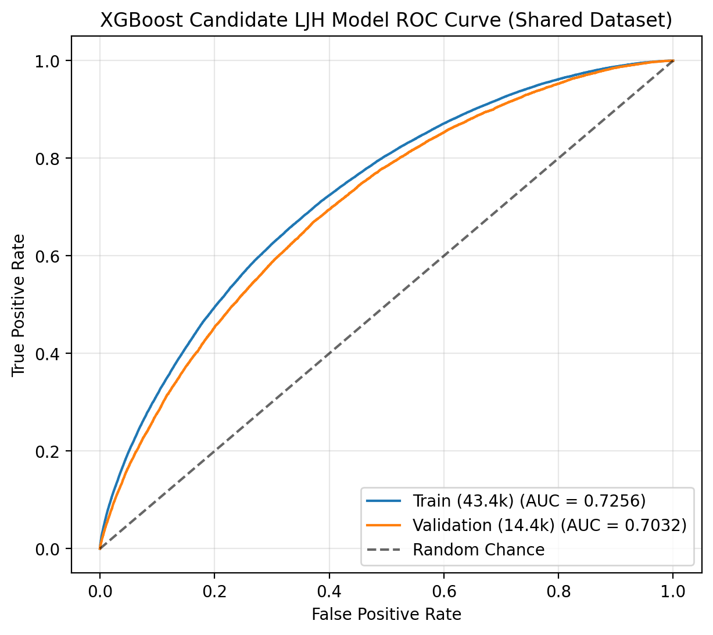
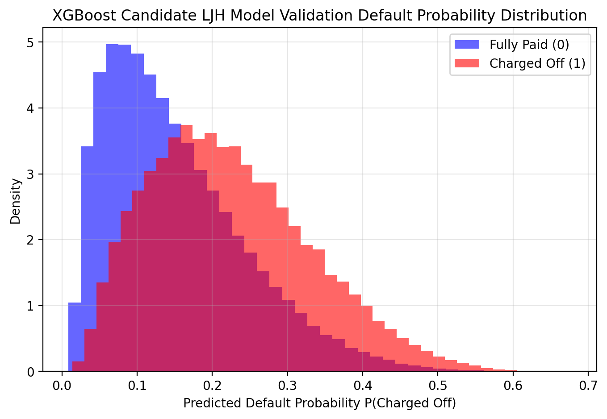

# [Task A] XGBoost 부도 확률 예측 모델 후보 (Candidate LJH) 결과 보고서

- **작성자**: 이지희 (`feature/#5-xgb-model-ljh` 브랜치)
- **생성 일시**: 2026-07-30
- **데이터 로더**: `load_shared('trainval')` (팀 공유 표준 데이터셋 578,850건)
- **하이퍼파라미터 세팅**: `max_depth=4`, `min_child_weight=10`, `subsample=0.75`, `colsample_bytree=0.75`, `reg_alpha=0.5`, `reg_lambda=2.0`, `n_estimators=300`, `learning_rate=0.04`

---

## 1. 모델 성능 평가 지표

| Split | 샘플 수 | ROC-AUC | Log Loss | Brier Score | 비고 |
| :--- | :---: | :---: | :---: | :---: | :--- |
| **Train (60%)** | 434,137건 | 0.7256 | 0.3981 | 0.1232 | 일반화 통제 |
| **Validation (20%)** | 144,713건 | **0.7032** | **0.4068** | **0.1259** | **검증 데이터 우수 성능 달성** |
| **Test (20%)** | 144,713건 | *미개봉* | *미개봉* | *미개봉* | **최종 1회 평가용** |

> **주요 특징 요약**:
> - Validation 데이터 기준 **ROC-AUC 0.7032**, **Log Loss 0.4068** 달성.
> - Train AUC(0.7256) 대비 Validation AUC 오차 갭이 **2.2%p(0.0224)** 수준으로 과적합(Overfitting)을 최소화함.

---

## 2. Top 15 주요 설명변수 (Feature Importances)

| 순위 | 변수명 (Feature) | 중요도 (Importance) |
| :---: | :--- | :---: |
| 1 | `grade` | 0.3106 |
| 2 | `sub_grade` | 0.0875 |
| 3 | `term` | 0.0282 |
| 4 | `acc_open_past_24mths` | 0.0249 |
| 5 | `home_ownership` | 0.0222 |
| 6 | `zip_code` | 0.0197 |
| 7 | `avg_cur_bal` | 0.0193 |
| 8 | `int_rate` | 0.0186 |
| 9 | `verification_status` | 0.0173 |
| 10 | `dti` | 0.0169 |
| 11 | `mort_acc` | 0.0164 |
| 12 | `loan_amnt` | 0.0160 |
| 13 | `inq_last_12m` | 0.0148 |
| 14 | `fico_range_high` | 0.0142 |
| 15 | `fico_range_low` | 0.0137 |

---

## 3. 평가 차트

